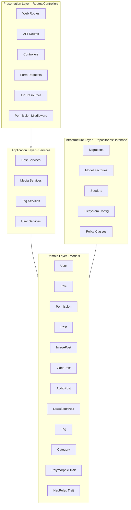

# CloudHerder.nz - CMS Architecture

**Project:** Multi-Type CMS with Polymorphic Posts
**Generated:** 2026-02-12
**Framework:** Laravel 12.x

---

## 1. Entity Relationship Diagram

```mermaid
erDiagram
    User ||--o{ Post : "authors"
    User ||--o{ Role : "has"
    User ||--o{ Permission : "has"
    Role ||--o{ Permission : "has"
    Post ||--|| Postable : "polymorphic"
    Post ||--o{ Taggable : "has"
    Post ||--o{ Categorizable : "has"
    ImagePost ||--|{ Media : "gallery"
    VideoPost ||--|{ Media : "video"
    AudioPost ||--|{ Media : "audio"
    NewsletterPost ||--|| Post : "polymorphic"
    NewsletterPost ||--o{ Taggable : "has"
    NewsletterPost ||--o{ Categorizable : "has"

    User {
        bigint id PK
        string name
        string email
        string password
        timestamp email_verified_at
        timestamp created_at
        timestamp updated_at
    }

    Role {
        bigint id PK
        string name
        string guard_name
        timestamp created_at
    }

    Permission {
        bigint id PK
        string name
        string guard_name
        timestamp created_at
    }

    Post {
        bigint id PK
        string title
        string slug
        text excerpt
        text content
        string featured_image
        bigint author_id FK
        string status
        timestamp published_at
        string postable_type
        bigint postable_id
        timestamp created_at
        timestamp updated_at
        timestamp deleted_at
    }

    Postable {
        bigint id PK
        string type
    }

    ImagePost {
        bigint id PK
        string caption
        json gallery_settings
    }

    VideoPost {
        bigint id PK
        string video_url
        string thumbnail_url
        int duration_seconds
        string provider
        int episode_number
    }

    AudioPost {
        bigint id PK
        string audio_url
        int duration_seconds
        int episode_number
    }

    NewsletterPost {
        bigint id PK
        string uuid UNIQUE
        string subject
        text excerpt
        text content
        timestamp sent_at
        unsignedInteger view_count
        timestamp created_at
        timestamp updated_at
    }

    Tag {
        bigint id PK
        string name
        string slug
        timestamp created_at
    }

    Taggable {
        bigint tag_id FK
        bigint taggable_id FK
        string taggable_type
    }

    Category {
        bigint id PK
        string name
        string slug
        bigint parent_id FK
        timestamp created_at
    }

    Categorizable {
        bigint category_id FK
        bigint categorizable_id FK
        string categorizable_type
    }

    Media {
        bigint id PK
        string model_type
        bigint model_id FK
        string collection_name
        string file_name
        string file_extension
        string file_mime
        bigint file_size
        string disk
        json manipulations
        json custom_properties
        timestamp created_at
        timestamp updated_at
    }
```

---

## 2. Layered Architecture



---

## 3. Database Schema

### Users + Spatie Permission Tables

```php
// roles (created by Spatie Permission)
Schema::create('roles', function (Blueprint $table) {
    $table->id();
    $table->string('name')->unique();
    $table->string('guard_name');
    $table->timestamps();
});
```

(Additional tables omitted for brevity)
